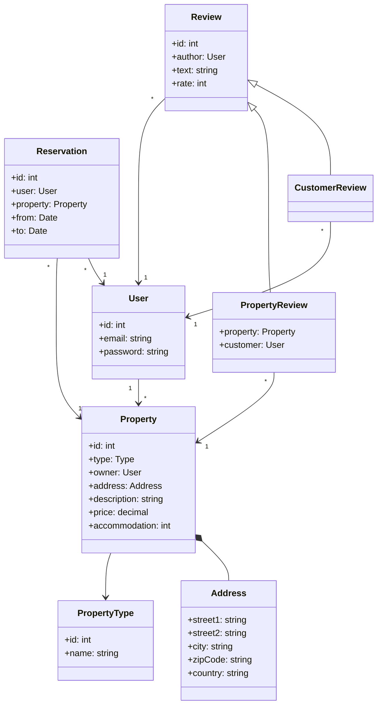

```mermaid
classDiagram
  class User {
    +id: int
    +email: string
    +password: string
  }

  class PropertyType {
    +id: int
    +name: string
  }

  class Property {
    +id: int
    +type: Type
    +owner: User
    +address: Address
    +description: string
    +price: decimal
    +accommodation: int
  }

  class Address {
    +street1: string
    +street2: string
    +city: string
    +zipCode: string
    +country: string
  }

  class Reservation {
    +id: int
    +user: User
    +property: Property
    +from: Date
    +to: Date
  }

  class Review {
    +id: int
    +author: User
    +text: string
    +rate: int
  }

  class PropertyReview {
    +property: Property
  }

  class PropertyReview {
    +customer: User
  }

  User "1" --> "*" Property

  Property --> PropertyType
  Property *-- Address

  Reservation "*" --> "1" Property
  Reservation "*" --> "1" User

  Review "*" --> "1" User
  Review <|-- PropertyReview
  Review <|-- CustomerReview

  PropertyReview "*" --> "1" Property
  CustomerReview "*" --> "1" User
```
